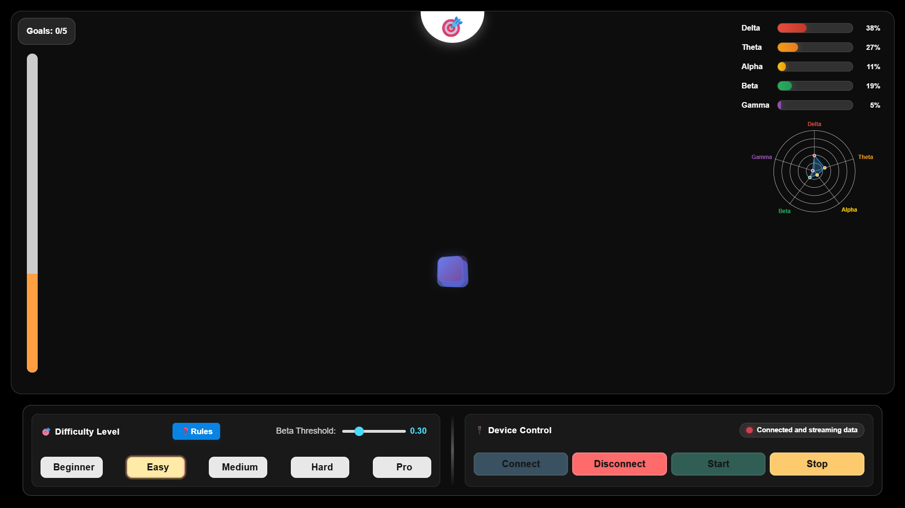

# 🧠 Cuboid – Brain-Controlled Game



Welcome to **Cuboid**, an innovative neurofeedback game where you control shapes using your brainwaves! Using real-time EEG signals, you guide geometric shapes to the goal by increasing your **beta brainwave activity** — a truly mind-powered experience.

----

## 🔗 Requirements

- Neuro PlayGround Lite (NPG Lite) hardware device
- Web Bluetooth-compatible browser (Chrome / Edge)
- Secure context (HTTPS or `localhost`) to access BLE

---

## 🧩 Features

- 🎯 Goal-based gameplay driven by your **brainwave focus**
- 📶 Real-time EEG streaming from BLE devices like NPG Lite
- 🎛️ Multiple difficulty levels:
  - Beginner, Easy, Medium, Hard, Pro
- 📊 Live brainwave band visualization:
  - Delta, Theta, Alpha, Beta, Gamma
- 🔌 Device control panel (Connect / Disconnect / Start / Stop)
- 🎉 Goal celebrations and a win state on achieving 5 goals

---

## 🧪 File Structure

```
Cuboid/
├── index.html         # Main game logic and UI
├── style.css          # Custom styles and animations
├── README.md          # Project documentation
└── assets/            # Add device images, icons, or EEG diagrams
```

---

## 🕹️ How to Play

**Cuboid** is a neurofeedback game that uses your brain's electrical activity (EEG) to move shapes. Here's how to get started:

### 🧠 Goal:
Move the shape **upward into the GOAL zone** by increasing your **Beta brainwave activity (focus/alertness)**. Do it 5 times to win!

---

### 🔌 1. Connect Your NPG Lite Device
- Make sure your NPG Lite is powered on and advertising via **Bluetooth Low Energy (BLE)**.
- Open `index.html` in **Chrome** or **Edge** (must support Web Bluetooth).
- Click the `Connect` button.
- Select your device from the list.

---

### 🎯 2. Choose Difficulty
- Select from: **Beginner, Easy, Medium, Hard, Pro**
- Difficulty affects movement speed (not threshold):
  - Easier levels move faster when focused
  - Harder levels move slower when focused

---

### 🎮 Current Difficulty Design Logic

| Level    | Step Forward | Step Back | Notes                                         |
|----------|--------------|-----------|-----------------------------------------------|
| Beginner | 15           | 3         | Very forgiving, quick progress with little penalty |
| Easy     | 13           | 5         | Still easy, but backward penalty is noticeable |
| Medium   | 10           | 6         | Balanced challenge                            |
| Hard     | 8            | 7         | Small reward, steep penalty                   |
| Pro      | 7            | 8         | Progress is slower than regress — very strict |

---

### ▶️ 3. Start the EEG Stream
- Click `Start Stream` after connecting.
- The game will automatically begin a **5-second calibration phase** to measure your maximum beta activity.
- After calibration, EEG data will start flowing, and bars for **Delta, Theta, Alpha, Beta, Gamma** will update in real-time.

---

### 🧠 4. Focus and Control
- Focus your mind to raise **Beta waves** above your personal threshold.
- When your beta activity is sustained for 3 seconds, the shape moves upward.
- If beta drops below threshold for 3 seconds, the shape moves downward.
- If it reaches the goal zone — 🎉 you score a GOAL!

---

### 🏆 5. Win the Game
- Score **5 goals** to win.
- You'll see a **"YOU WIN"** celebration screen.
- Click "Play Again" to restart.

---

### 🧘‍♀️ Tips for Playing
- During calibration, try to focus intensely to set a higher personal threshold
- Maintain consistent focus - the shape moves after 3 seconds of sustained beta activity
- Avoid distractions. Calm but alert minds tend to score better.
- Practice different mental states to observe how brainwaves shift.

## 👩‍💻 Author

Built with curiosity by [**Ritika Mishra**](https://github.com/Ritika8081)

> Decoding mindfulness with every brainwave 💫

---

## 🤝 Contributing

Contributions are welcome! 🎉  
If you have ideas for new features, want to improve UI/UX, or optimize EEG signal processing—feel free to fork the repo, create a branch, and submit a pull request.

Steps to contribute:
1. Fork this repository
2. Create your feature branch: `git checkout -b feature-name`
3. Commit your changes: `git commit -m 'Add some feature'`
4. Push to the branch: `git push origin feature-name`
5. Open a pull request

---

## 📜 License

**MIT License** – use freely, but give credit!